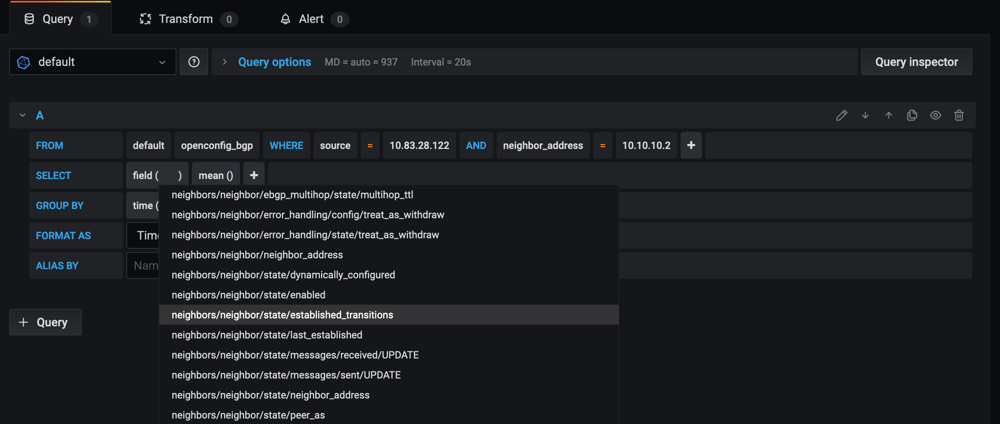

 

# Arista EOS using gNMI and Telegraf

- [Arista EOS using gNMI and Telegraf](#arista-eos-using-gnmi-and-telegraf)
  - [About this repository](#about-this-repository)
  - [Demo building blocks](#demo-building-blocks)
    - [Arista devices configuration](#arista-devices-configuration)
    - [Telegraf configuration file](#telegraf-configuration-file)
    - [Build the Telegraf/InfluxDB/Grafana(TIG) stack](#build-the-telegrafinfluxdbgrafanatig-stack)
    - [Play with data](#play-with-data)
    - [Python and InfluxDB](#python-and-influxdb)
      - [Requirements](#requirements)
      - [Python interactive session](#python-interactive-session)
  - [License](#license)

## About this repository

This repository shows the steps to demo streaming telemetry with Arista EOS devices and Telegraf.
It covers both OpenConfig telemetry and native telemetry.

- [__Telegraf__](https://www.influxdata.com/time-series-platform/telegraf/) is an open source collector written in GO. it collects data and writes them into a database and is plugin-driven (it has input plugins, output plugins, ...)

- [__InfluxDB__](https://www.influxdata.com/products/influxdb-overview/) is an open source time series database written in GO.

- [__Grafana__](https://grafana.com/): An open source tool used to visualize time series data. It supports __InfluxDB__ and other backend. It runs as a web application. It is written in GO.

__Additional resources:__

- [Build Stack with docker](./DOCKER.md)
- [Build Stack with docker-compose](./COMPOSE.md)
- [InfluxDB Query examples](./Influxdb.md)

## Demo building blocks

- __EOS devices__: There is a gNMI server in EOS devices.
- __Telegraf__: It has a gNMI client. It subscribes to paths (OpenConfig and native) on targets (Arista EOS devices).
- __InfluxDB__: Telegraf writes on InfluxDB the data streamed from network devices.

So devices will stream OpenConfig and EOS native data to __Telegraf__. __Telegraf__ will store the data to __InfluxDB__. Then we will query __InfluxDB__ with __Grafana__.

### Arista devices configuration

Enable and allow gNMI on Arista EOS devices:

```
arista-sw> enable
arista-sw# configure

username arista secret 0 arista
ip access-list GNMI
  10 permit tcp any any eq gnmi
management api gnmi
  transport grpc def
    ip access-group GNMI
  provider eos-native
```

__`provider eos-native`__ is required to serve gNMI subscription requests to EOS native paths.
So, using the above configuration, a gNMI client can subscribes to both OpenConfig paths and native paths.

### Telegraf configuration file

Here's a Telegraf configuration file example [telegraf.conf](config_files/telegraf.conf).
It uses:

- a __gNMI__ input plugin configured to subscribe to OpenConfig and native paths
- InfluxDB output plugin

So the devices will stream OpenConfig and EOS native data to __Telegraf__. And __Telegraf__ will store the data to __Influxdb__.

> Note: To subscribe to both OpenConfig and native paths, the gNMI client must send 2 different subscription requests.

In this demo, the gNMI input plugin is configured with 2 different subscription requests: one to subscribe to a set of OpenConfig paths and another one to subscribe to a set of native paths. Update [telegraf configuration](config_files/telegraf.conf) to configure IP addresses of your devices

```conf
addresses = ["10.83.28.122:6030", "10.83.28.125:6030"]

## credentials
username = "arista"
password = "arista"
```

You can update EOS sysdb path by updating `inputs.cisco_telemetry_gnmi.subscription` as well.

### Build the Telegraf/InfluxDB/Grafana(TIG) stack

A TIG stack uses:

- __Telegraf__ to collect data and to write the collected data in InfluxDB.
- __InfluxDB__ to store the data collected.
- __Grafana__ to visualize the data stored in InfluxDB.

We can use of one these different workflows to build the TIG stack:


```shell
$ docker-compose up -d -f docker-compose.yml
```

More detailed guides are available for both docker and docker-compose:

- [Docker-compose workflow](./COMPOSE.md)
- [Docker workflow](./DOCKER.md)


You can now use the Grafana GUI http://localhost:3000
The default username and password are admin/admin, but we changed them to __arista__/___arista___
The datasource is already configured. It uses InfluxDB.
There is no dashboard configured. You can create your own dashboards.



### Play with data

You can now play with data within Telegraf and InfluxDB

__Start an interactive session__

```shell
docker exec -it influxdb bash

root@c3ead2edcf5a:/# influx
Connected to http://localhost:8086 version 1.8.0
InfluxDB shell version: 1.8.0

> SHOW DATABASES
name: databases
name
----
arista
_internal
```

More examples of [InfluxDB queries](./Influxdb.md) are available [here](./Influxdb.md)

### Python and InfluxDB

#### Requirements

```shell

$ python -V
Python 3.7.7

$ pip install -r requirements.txt

$ pip freeze | grep influxdb
influxdb==5.3.0
```

#### Python interactive session

```python
$ python
Python 3.7.7 (default, Mar 10 2020, 15:43:33)
[Clang 11.0.0 (clang-1100.0.33.17)] on darwin
Type "help", "copyright", "credits" or "license" for more information.

>>> from influxdb import InfluxDBClient

>>> influx_client = InfluxDBClient('localhost',8086)

>>> influx_client.query('show databases')
ResultSet({'('databases', None)': [{'name': 'arista'}, {'name': '_internal'}]})

>>> influx_client.query('show measurements', database='arista')
ResultSet({'('measurements', None)': [{'name': 'eos_bgp'}, {'name': 'ifcounters'}, {'name': 'openconfig_bgp'}]})

>>> points = influx_client.query("""SELECT "in_octets" FROM "ifcounters" \
  WHERE ("source" = '10.83.28.122' AND "name"='Ethernet24') \
  ORDER BY DESC LIMIT 3""", database='arista').get_points()

>>> for point in points:
...     print(point['in_octets'])
...
397378
397152
396993
>>>
>>> exit()
```

## License

This repository is proposed with [Apache License](./LICENSE)