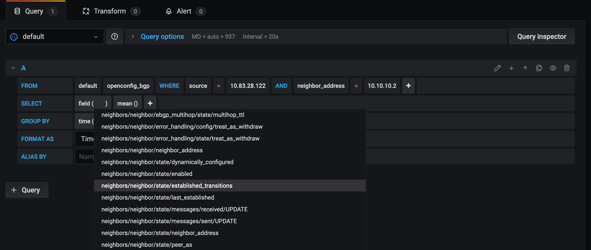

    

# Tables of content 

[About this repository](#about-this-repository)   
[About Telegraf](#about-telegraf)  
[About InfluxDB](#about-influxdb)  
[About Grafana](#about-grafana)  
[Demo building blocks](#demo-building-blocks)   
[Arista devices configuration](#arista-devices-configuration)   
[Telegraf configuration file](#telegraf-configuration-file)   
[Build the TIG stack](#build-the-tig-stack)   
[Verify Telegraf logs](#verify-telegraf-logs)   
[InfluxDB query examples using CLI](#influxdb-query-examples-using-cli)   
[InfluxDB query examples using Python](#influxdb-query-examples-using-python)   
[Grafana GUI](#grafana-gui)  

# About this repository  

This repository shows the steps to demo streaming telemetry with Arista EOS devices and Telegraf.  
It covers both OpenConfig telemetry and native telemetry.  

# About Telegraf 

Telegraf is an open source collector written in GO.  
Telegraf collects data and writes them into a database.  
It is plugin-driven (it has input plugins, output plugins, ...)  

# About InfluxDB

InfluxDB is an open source time series database written in GO.

# About Grafana

Grafana is an open source tool used to visualize time series data.  
It supports InfluxDB and other backends.  
It runs as a web application.  
It is written in GO.  

# Demo building blocks 

  - EOS devices: There is a gNMI server in EOS devices.    
  - Telegraf: It has a gNMI client. It subscribes to paths (OpenConfig and native) on targets (Arista EOS devices).
  - InfluxDB: Telegraf writes on InfluxDB the data streamed from network devices.    

So the devices will stream OpenConfig and EOS native data to Telegraf. Telegraf will store the data to InfluxDB. Then we will query InfluxDB.  

# Arista devices configuration

Enable and allow gNMI:

```
enable
configure
username arista secret 0 arista
ip access-list GNMI
  10 permit tcp any any eq gnmi
management api gnmi
  transport grpc def
    ip access-group GNMI
  provider eos-native
```

`provider eos-native` is required to serve gNMI subscription requests to EOS native paths.  
So, using the above configuration, a gNMI client can subscribes to both OpenConfig paths and native paths.  

# Telegraf configuration file

Here's a Telegraf configuration file example [telegraf.conf](telegraf.conf). 
It uses: 
 - a gNMI input plugin configured to subscribe to OpenConfig and native paths 
 - the influxDB output plugin   

So the devices will stream OpenConfig and EOS native data to Telegraf. And Telegraf will store the data to Influxdb.  

Note: To subscribe to both OpenConfig and native paths, the gNMI client must send 2 differents subscription requests.  
So, in this demo, the gNMI input plugin is configured with 2 differents subscription requests: one to subscribe to a set of OpenConfig paths and another one to subscribe to a set of native paths.  


# Build the TIG stack

A TIG stack uses:
- Telegraf to collect data and to write the collected data in InfluxDB. 
- InfluxDB to store the data collected. 
- Grafana to visualize the data stored in InfluxDB. 

We can use of one these differents workflows to build the TIG stack:
- Docker-compose workflow
- Docker workflow

## Docker workflow

### Install Docker

```
docker -v
Docker version 19.03.8, build afacb8b
```

### Pull the Docker images

This is optionnal as they will be pulled automatically if necessary.  

```
docker pull telegraf:1.14.3
docker pull influxdb:1.8.0
docker pull grafana/grafana:7.0.3
```

### List Docker images

```
docker images
```
<details><summary>click me to see the response</summary>
<p>
  
```
REPOSITORY          TAG                 IMAGE ID            CREATED             SIZE
grafana/grafana     7.0.3               22fccd4fab0a        6 days ago          158MB
telegraf            1.14.3              6fdd3e021713        2 weeks ago         251MB
influxdb            1.8.0               1bf862b66ac1        3 weeks ago         304MB
```
</p>
</details>


### Create a Docker network 

```
docker network create tig
```

### List Docker networks 

```
docker network ls
```

### Create Docker containers 

```
docker run -d --name influxdb -p 8083:8083 -p 8086:8086 --network=tig influxdb:1.8.0
docker run -d --name telegraf -v $PWD/telegraf.conf:/etc/telegraf/telegraf.conf:ro --network=tig telegraf:1.14.3
docker run -d --name grafana -p 3000:3000 --network=tig grafana/grafana:7.0.3
```

### List Docker running containers 

```
docker ps
```
<details><summary>click me to see the response</summary>
<p>
  
```
CONTAINER ID        IMAGE                   COMMAND                  CREATED             STATUS              PORTS                                            NAMES
bfe273b6b299        telegraf:1.14.3         "/entrypoint.sh tele…"   12 seconds ago      Up 11 seconds       8092/udp, 8125/udp, 8094/tcp                     telegraf
c3ead2edcf5a        influxdb:1.8.0          "/entrypoint.sh infl…"   20 seconds ago      Up 18 seconds       0.0.0.0:8083->8083/tcp, 0.0.0.0:8086->8086/tcp   influxdb
c818fb9ce85f        grafana/grafana:7.0.3   "/run.sh"                4 hours ago         Up 4 hours          0.0.0.0:3000->3000/tcp                           grafana
```
</p>
</details>


### Display detailed information about the Docker network 

```
docker network inspect tig
```
<details><summary>click me to see the output</summary>
<p>

```
[
    {
        "Name": "tig",
        "Id": "8c56cd4a208c8f64556963f725af786dd3f3c14ac458db503c82574307d51c0b",
        "Created": "2020-06-01T20:31:43.5383398Z",
        "Scope": "local",
        "Driver": "bridge",
        "EnableIPv6": false,
        "IPAM": {
            "Driver": "default",
            "Options": {},
            "Config": [
                {
                    "Subnet": "172.18.0.0/16",
                    "Gateway": "172.18.0.1"
                }
            ]
        },
        "Internal": false,
        "Attachable": false,
        "Ingress": false,
        "ConfigFrom": {
            "Network": ""
        },
        "ConfigOnly": false,
        "Containers": {
            "bfe273b6b2992021b911f442acca4980ce19b46e6bc0865dcba354cf8fcf0121": {
                "Name": "telegraf",
                "EndpointID": "f6dfac8660c257b437a2b5b218ee67142961c7fc087f11b664c982052b4cee98",
                "MacAddress": "02:42:ac:12:00:03",
                "IPv4Address": "172.18.0.3/16",
                "IPv6Address": ""
            },
            "c3ead2edcf5a52303f66cf38fc9a24dd80f8b50e6819357bde4541798a825308": {
                "Name": "influxdb",
                "EndpointID": "6e5bf29fba94b2db65af929c2682317b6538292250ca04097697f8659f52ab40",
                "MacAddress": "02:42:ac:12:00:02",
                "IPv4Address": "172.18.0.2/16",
                "IPv6Address": ""
            },
            "c818fb9ce85fdb91fdbac91a2135b20d50bbba93ddc1fca453c85d81677f31f6": {
                "Name": "grafana",
                "EndpointID": "a471c77ee0afc1e953206f3eefe6996f1a23b82d930a3b36a99e1fe07b0d59b0",
                "MacAddress": "02:42:ac:12:00:04",
                "IPv4Address": "172.18.0.4/16",
                "IPv6Address": ""
            }
        },
        "Options": {},
        "Labels": {}
    }
]
```
</p>
</details>


## Docker-compose workflow

### Install Docker

```
docker -v
Docker version 19.03.8, build afacb8b
```

### Install Docker-compose

```
docker-compose -v
docker-compose version 1.25.5, build 8a1c60f6
```

### Pull the Docker images

This is optionnal as they will be pulled automatically if necessary.  

```
docker pull telegraf:1.14.3
docker pull influxdb:1.8.0
docker pull grafana/grafana:7.0.3
```

### List Docker images

```
docker images
```
<details><summary>click me to see the response</summary>
<p>
  
```
REPOSITORY          TAG                 IMAGE ID            CREATED             SIZE
grafana/grafana     7.0.3               22fccd4fab0a        6 days ago          158MB
telegraf            1.14.3              6fdd3e021713        2 weeks ago         251MB
influxdb            1.8.0               1bf862b66ac1        3 weeks ago         304MB
```
</p>
</details>

### Create and start the containers 

We can use this [docker-compose.yml](docker-compose.yml) file to create a TIG stack.  

```
docker-compose -f docker-compose.yml up -d
```

### List Docker running containers 

```
docker-compose ps
```
<details><summary>click me to see the response</summary>
<p>
  
```
  Name             Command           State              Ports            
-------------------------------------------------------------------------
grafana    /run.sh                   Up      0.0.0.0:3000->3000/tcp      
influxdb   /entrypoint.sh influxd    Up      8083/tcp, 8086/tcp          
telegraf   /entrypoint.sh telegraf   Up      8092/udp, 8094/tcp, 8125/udp
```
</p>
</details>

```
docker ps
```
<details><summary>click me to see the response</summary>
<p>
  
```
CONTAINER ID        IMAGE                   COMMAND                  CREATED             STATUS              PORTS                                            NAMES
bfe273b6b299        telegraf:1.14.3         "/entrypoint.sh tele…"   12 seconds ago      Up 11 seconds       8092/udp, 8125/udp, 8094/tcp                     telegraf
c3ead2edcf5a        influxdb:1.8.0          "/entrypoint.sh infl…"   20 seconds ago      Up 18 seconds       0.0.0.0:8083->8083/tcp, 0.0.0.0:8086->8086/tcp   influxdb
c818fb9ce85f        grafana/grafana:7.0.3   "/run.sh"                4 hours ago         Up 4 hours          0.0.0.0:3000->3000/tcp                           grafana
```
</p>
</details>

# Verify Telegraf logs

```
docker logs telegraf
```
<details><summary>click me to see the output</summary>
<p>

```
2020-06-09T23:46:34Z I! Starting Telegraf 1.14.3
2020-06-09T23:46:34Z I! Using config file: /etc/telegraf/telegraf.conf
2020-06-09T23:46:34Z I! Loaded inputs: cisco_telemetry_gnmi cisco_telemetry_gnmi
2020-06-09T23:46:34Z I! Loaded aggregators: 
2020-06-09T23:46:34Z I! Loaded processors: 
2020-06-09T23:46:34Z I! Loaded outputs: influxdb
2020-06-09T23:46:34Z I! Tags enabled: host=bfe273b6b299
2020-06-09T23:46:34Z I! [agent] Config: Interval:10s, Quiet:false, Hostname:"bfe273b6b299", Flush Interval:10s
```
</p>
</details>

# InfluxDB query examples using CLI

## Start an interactive session

```
docker exec -it influxdb bash
```

```
root@c3ead2edcf5a:/# influx
Connected to http://localhost:8086 version 1.8.0
InfluxDB shell version: 1.8.0
> 
```

## List databases 

```
> SHOW DATABASES
```
<details><summary>click me to see the response</summary>
<p>

```
name: databases
name
----
arista
_internal
```
</p>
</details>

## Select a database 

```
> USE arista
Using database arista
```

## List measurements 

```
> SHOW MEASUREMENTS
```
<details><summary>click me to see the response</summary>
<p>

```
name: measurements
name
----
eos_bgp
ifcounters
openconfig_bgp
> 
```
</p>
</details>

## List series 

```
> SHOW SERIES FROM "ifcounters"
```
<details><summary>click me to see the output</summary>
<p>

```
key
---
ifcounters,host=bfe273b6b299,name=Ethernet1,source=10.83.28.122
ifcounters,host=bfe273b6b299,name=Ethernet1,source=10.83.28.125
ifcounters,host=bfe273b6b299,name=Ethernet10,source=10.83.28.122
ifcounters,host=bfe273b6b299,name=Ethernet10,source=10.83.28.125
ifcounters,host=bfe273b6b299,name=Ethernet11,source=10.83.28.122
ifcounters,host=bfe273b6b299,name=Ethernet11,source=10.83.28.125
ifcounters,host=bfe273b6b299,name=Ethernet12,source=10.83.28.122
ifcounters,host=bfe273b6b299,name=Ethernet12,source=10.83.28.125
ifcounters,host=bfe273b6b299,name=Ethernet13,source=10.83.28.122
ifcounters,host=bfe273b6b299,name=Ethernet13,source=10.83.28.125
ifcounters,host=bfe273b6b299,name=Ethernet14,source=10.83.28.122
ifcounters,host=bfe273b6b299,name=Ethernet14,source=10.83.28.125
ifcounters,host=bfe273b6b299,name=Ethernet15,source=10.83.28.122
ifcounters,host=bfe273b6b299,name=Ethernet15,source=10.83.28.125
ifcounters,host=bfe273b6b299,name=Ethernet16,source=10.83.28.122
ifcounters,host=bfe273b6b299,name=Ethernet16,source=10.83.28.125
ifcounters,host=bfe273b6b299,name=Ethernet17,source=10.83.28.122
ifcounters,host=bfe273b6b299,name=Ethernet17,source=10.83.28.125
ifcounters,host=bfe273b6b299,name=Ethernet18,source=10.83.28.122
ifcounters,host=bfe273b6b299,name=Ethernet18,source=10.83.28.125
ifcounters,host=bfe273b6b299,name=Ethernet19,source=10.83.28.122
ifcounters,host=bfe273b6b299,name=Ethernet19,source=10.83.28.125
ifcounters,host=bfe273b6b299,name=Ethernet2,source=10.83.28.122
ifcounters,host=bfe273b6b299,name=Ethernet2,source=10.83.28.125
ifcounters,host=bfe273b6b299,name=Ethernet20,source=10.83.28.122
ifcounters,host=bfe273b6b299,name=Ethernet20,source=10.83.28.125
ifcounters,host=bfe273b6b299,name=Ethernet21,source=10.83.28.122
ifcounters,host=bfe273b6b299,name=Ethernet21,source=10.83.28.125
ifcounters,host=bfe273b6b299,name=Ethernet22,source=10.83.28.122
ifcounters,host=bfe273b6b299,name=Ethernet22,source=10.83.28.125
ifcounters,host=bfe273b6b299,name=Ethernet23,source=10.83.28.122
ifcounters,host=bfe273b6b299,name=Ethernet23,source=10.83.28.125
ifcounters,host=bfe273b6b299,name=Ethernet24,source=10.83.28.122
ifcounters,host=bfe273b6b299,name=Ethernet24,source=10.83.28.125
ifcounters,host=bfe273b6b299,name=Ethernet25,source=10.83.28.122
ifcounters,host=bfe273b6b299,name=Ethernet25,source=10.83.28.125
ifcounters,host=bfe273b6b299,name=Ethernet26,source=10.83.28.122
ifcounters,host=bfe273b6b299,name=Ethernet26,source=10.83.28.125
ifcounters,host=bfe273b6b299,name=Ethernet27,source=10.83.28.122
ifcounters,host=bfe273b6b299,name=Ethernet27,source=10.83.28.125
ifcounters,host=bfe273b6b299,name=Ethernet28,source=10.83.28.122
ifcounters,host=bfe273b6b299,name=Ethernet28,source=10.83.28.125
ifcounters,host=bfe273b6b299,name=Ethernet29,source=10.83.28.122
ifcounters,host=bfe273b6b299,name=Ethernet29,source=10.83.28.125
ifcounters,host=bfe273b6b299,name=Ethernet3,source=10.83.28.122
ifcounters,host=bfe273b6b299,name=Ethernet3,source=10.83.28.125
ifcounters,host=bfe273b6b299,name=Ethernet30,source=10.83.28.122
ifcounters,host=bfe273b6b299,name=Ethernet30,source=10.83.28.125
ifcounters,host=bfe273b6b299,name=Ethernet31,source=10.83.28.122
ifcounters,host=bfe273b6b299,name=Ethernet31,source=10.83.28.125
ifcounters,host=bfe273b6b299,name=Ethernet32,source=10.83.28.122
ifcounters,host=bfe273b6b299,name=Ethernet32,source=10.83.28.125
ifcounters,host=bfe273b6b299,name=Ethernet33,source=10.83.28.122
ifcounters,host=bfe273b6b299,name=Ethernet33,source=10.83.28.125
ifcounters,host=bfe273b6b299,name=Ethernet34,source=10.83.28.122
ifcounters,host=bfe273b6b299,name=Ethernet34,source=10.83.28.125
ifcounters,host=bfe273b6b299,name=Ethernet35,source=10.83.28.122
ifcounters,host=bfe273b6b299,name=Ethernet35,source=10.83.28.125
ifcounters,host=bfe273b6b299,name=Ethernet36,source=10.83.28.122
ifcounters,host=bfe273b6b299,name=Ethernet36,source=10.83.28.125
ifcounters,host=bfe273b6b299,name=Ethernet37,source=10.83.28.122
ifcounters,host=bfe273b6b299,name=Ethernet37,source=10.83.28.125
ifcounters,host=bfe273b6b299,name=Ethernet38,source=10.83.28.122
ifcounters,host=bfe273b6b299,name=Ethernet38,source=10.83.28.125
ifcounters,host=bfe273b6b299,name=Ethernet39,source=10.83.28.122
ifcounters,host=bfe273b6b299,name=Ethernet39,source=10.83.28.125
ifcounters,host=bfe273b6b299,name=Ethernet4,source=10.83.28.122
ifcounters,host=bfe273b6b299,name=Ethernet4,source=10.83.28.125
ifcounters,host=bfe273b6b299,name=Ethernet40,source=10.83.28.122
ifcounters,host=bfe273b6b299,name=Ethernet40,source=10.83.28.125
ifcounters,host=bfe273b6b299,name=Ethernet41,source=10.83.28.122
ifcounters,host=bfe273b6b299,name=Ethernet41,source=10.83.28.125
ifcounters,host=bfe273b6b299,name=Ethernet42,source=10.83.28.122
ifcounters,host=bfe273b6b299,name=Ethernet42,source=10.83.28.125
ifcounters,host=bfe273b6b299,name=Ethernet43,source=10.83.28.122
ifcounters,host=bfe273b6b299,name=Ethernet43,source=10.83.28.125
ifcounters,host=bfe273b6b299,name=Ethernet44,source=10.83.28.122
ifcounters,host=bfe273b6b299,name=Ethernet44,source=10.83.28.125
ifcounters,host=bfe273b6b299,name=Ethernet45,source=10.83.28.122
ifcounters,host=bfe273b6b299,name=Ethernet45,source=10.83.28.125
ifcounters,host=bfe273b6b299,name=Ethernet46,source=10.83.28.122
ifcounters,host=bfe273b6b299,name=Ethernet46,source=10.83.28.125
ifcounters,host=bfe273b6b299,name=Ethernet47,source=10.83.28.122
ifcounters,host=bfe273b6b299,name=Ethernet47,source=10.83.28.125
ifcounters,host=bfe273b6b299,name=Ethernet48,source=10.83.28.122
ifcounters,host=bfe273b6b299,name=Ethernet48,source=10.83.28.125
ifcounters,host=bfe273b6b299,name=Ethernet49/1,source=10.83.28.122
ifcounters,host=bfe273b6b299,name=Ethernet49/1,source=10.83.28.125
ifcounters,host=bfe273b6b299,name=Ethernet49/2,source=10.83.28.122
ifcounters,host=bfe273b6b299,name=Ethernet49/2,source=10.83.28.125
ifcounters,host=bfe273b6b299,name=Ethernet49/3,source=10.83.28.122
ifcounters,host=bfe273b6b299,name=Ethernet49/3,source=10.83.28.125
ifcounters,host=bfe273b6b299,name=Ethernet49/4,source=10.83.28.122
ifcounters,host=bfe273b6b299,name=Ethernet49/4,source=10.83.28.125
ifcounters,host=bfe273b6b299,name=Ethernet5,source=10.83.28.122
ifcounters,host=bfe273b6b299,name=Ethernet5,source=10.83.28.125
ifcounters,host=bfe273b6b299,name=Ethernet50/1,source=10.83.28.122
ifcounters,host=bfe273b6b299,name=Ethernet50/1,source=10.83.28.125
ifcounters,host=bfe273b6b299,name=Ethernet50/2,source=10.83.28.122
ifcounters,host=bfe273b6b299,name=Ethernet50/2,source=10.83.28.125
ifcounters,host=bfe273b6b299,name=Ethernet50/3,source=10.83.28.122
ifcounters,host=bfe273b6b299,name=Ethernet50/3,source=10.83.28.125
ifcounters,host=bfe273b6b299,name=Ethernet50/4,source=10.83.28.122
ifcounters,host=bfe273b6b299,name=Ethernet50/4,source=10.83.28.125
ifcounters,host=bfe273b6b299,name=Ethernet51/1,source=10.83.28.122
ifcounters,host=bfe273b6b299,name=Ethernet51/1,source=10.83.28.125
ifcounters,host=bfe273b6b299,name=Ethernet51/2,source=10.83.28.122
ifcounters,host=bfe273b6b299,name=Ethernet51/2,source=10.83.28.125
ifcounters,host=bfe273b6b299,name=Ethernet51/3,source=10.83.28.122
ifcounters,host=bfe273b6b299,name=Ethernet51/3,source=10.83.28.125
ifcounters,host=bfe273b6b299,name=Ethernet51/4,source=10.83.28.122
ifcounters,host=bfe273b6b299,name=Ethernet51/4,source=10.83.28.125
ifcounters,host=bfe273b6b299,name=Ethernet52/1,source=10.83.28.122
ifcounters,host=bfe273b6b299,name=Ethernet52/1,source=10.83.28.125
ifcounters,host=bfe273b6b299,name=Ethernet52/2,source=10.83.28.122
ifcounters,host=bfe273b6b299,name=Ethernet52/2,source=10.83.28.125
ifcounters,host=bfe273b6b299,name=Ethernet52/3,source=10.83.28.122
ifcounters,host=bfe273b6b299,name=Ethernet52/3,source=10.83.28.125
ifcounters,host=bfe273b6b299,name=Ethernet52/4,source=10.83.28.122
ifcounters,host=bfe273b6b299,name=Ethernet52/4,source=10.83.28.125
ifcounters,host=bfe273b6b299,name=Ethernet6,source=10.83.28.122
ifcounters,host=bfe273b6b299,name=Ethernet6,source=10.83.28.125
ifcounters,host=bfe273b6b299,name=Ethernet7,source=10.83.28.122
ifcounters,host=bfe273b6b299,name=Ethernet7,source=10.83.28.125
ifcounters,host=bfe273b6b299,name=Ethernet8,source=10.83.28.122
ifcounters,host=bfe273b6b299,name=Ethernet8,source=10.83.28.125
ifcounters,host=bfe273b6b299,name=Ethernet9,source=10.83.28.122
ifcounters,host=bfe273b6b299,name=Ethernet9,source=10.83.28.125
ifcounters,host=bfe273b6b299,name=Management1,source=10.83.28.122
ifcounters,host=bfe273b6b299,name=Management1,source=10.83.28.125
```
</p>
</details>

```
> SHOW SERIES FROM "ifcounters" WHERE "source" = '10.83.28.122'
```
<details><summary>click me to see the response</summary>
<p>
  
```
key
---
ifcounters,host=bfe273b6b299,name=Ethernet1,source=10.83.28.122
ifcounters,host=bfe273b6b299,name=Ethernet10,source=10.83.28.122
ifcounters,host=bfe273b6b299,name=Ethernet11,source=10.83.28.122
ifcounters,host=bfe273b6b299,name=Ethernet12,source=10.83.28.122
ifcounters,host=bfe273b6b299,name=Ethernet13,source=10.83.28.122
ifcounters,host=bfe273b6b299,name=Ethernet14,source=10.83.28.122
ifcounters,host=bfe273b6b299,name=Ethernet15,source=10.83.28.122
ifcounters,host=bfe273b6b299,name=Ethernet16,source=10.83.28.122
ifcounters,host=bfe273b6b299,name=Ethernet17,source=10.83.28.122
ifcounters,host=bfe273b6b299,name=Ethernet18,source=10.83.28.122
ifcounters,host=bfe273b6b299,name=Ethernet19,source=10.83.28.122
ifcounters,host=bfe273b6b299,name=Ethernet2,source=10.83.28.122
ifcounters,host=bfe273b6b299,name=Ethernet20,source=10.83.28.122
ifcounters,host=bfe273b6b299,name=Ethernet21,source=10.83.28.122
ifcounters,host=bfe273b6b299,name=Ethernet22,source=10.83.28.122
ifcounters,host=bfe273b6b299,name=Ethernet23,source=10.83.28.122
ifcounters,host=bfe273b6b299,name=Ethernet24,source=10.83.28.122
ifcounters,host=bfe273b6b299,name=Ethernet25,source=10.83.28.122
ifcounters,host=bfe273b6b299,name=Ethernet26,source=10.83.28.122
ifcounters,host=bfe273b6b299,name=Ethernet27,source=10.83.28.122
ifcounters,host=bfe273b6b299,name=Ethernet28,source=10.83.28.122
ifcounters,host=bfe273b6b299,name=Ethernet29,source=10.83.28.122
ifcounters,host=bfe273b6b299,name=Ethernet3,source=10.83.28.122
ifcounters,host=bfe273b6b299,name=Ethernet30,source=10.83.28.122
ifcounters,host=bfe273b6b299,name=Ethernet31,source=10.83.28.122
ifcounters,host=bfe273b6b299,name=Ethernet32,source=10.83.28.122
ifcounters,host=bfe273b6b299,name=Ethernet33,source=10.83.28.122
ifcounters,host=bfe273b6b299,name=Ethernet34,source=10.83.28.122
ifcounters,host=bfe273b6b299,name=Ethernet35,source=10.83.28.122
ifcounters,host=bfe273b6b299,name=Ethernet36,source=10.83.28.122
ifcounters,host=bfe273b6b299,name=Ethernet37,source=10.83.28.122
ifcounters,host=bfe273b6b299,name=Ethernet38,source=10.83.28.122
ifcounters,host=bfe273b6b299,name=Ethernet39,source=10.83.28.122
ifcounters,host=bfe273b6b299,name=Ethernet4,source=10.83.28.122
ifcounters,host=bfe273b6b299,name=Ethernet40,source=10.83.28.122
ifcounters,host=bfe273b6b299,name=Ethernet41,source=10.83.28.122
ifcounters,host=bfe273b6b299,name=Ethernet42,source=10.83.28.122
ifcounters,host=bfe273b6b299,name=Ethernet43,source=10.83.28.122
ifcounters,host=bfe273b6b299,name=Ethernet44,source=10.83.28.122
ifcounters,host=bfe273b6b299,name=Ethernet45,source=10.83.28.122
ifcounters,host=bfe273b6b299,name=Ethernet46,source=10.83.28.122
ifcounters,host=bfe273b6b299,name=Ethernet47,source=10.83.28.122
ifcounters,host=bfe273b6b299,name=Ethernet48,source=10.83.28.122
ifcounters,host=bfe273b6b299,name=Ethernet49/1,source=10.83.28.122
ifcounters,host=bfe273b6b299,name=Ethernet49/2,source=10.83.28.122
ifcounters,host=bfe273b6b299,name=Ethernet49/3,source=10.83.28.122
ifcounters,host=bfe273b6b299,name=Ethernet49/4,source=10.83.28.122
ifcounters,host=bfe273b6b299,name=Ethernet5,source=10.83.28.122
ifcounters,host=bfe273b6b299,name=Ethernet50/1,source=10.83.28.122
ifcounters,host=bfe273b6b299,name=Ethernet50/2,source=10.83.28.122
ifcounters,host=bfe273b6b299,name=Ethernet50/3,source=10.83.28.122
ifcounters,host=bfe273b6b299,name=Ethernet50/4,source=10.83.28.122
ifcounters,host=bfe273b6b299,name=Ethernet51/1,source=10.83.28.122
ifcounters,host=bfe273b6b299,name=Ethernet51/2,source=10.83.28.122
ifcounters,host=bfe273b6b299,name=Ethernet51/3,source=10.83.28.122
ifcounters,host=bfe273b6b299,name=Ethernet51/4,source=10.83.28.122
ifcounters,host=bfe273b6b299,name=Ethernet52/1,source=10.83.28.122
ifcounters,host=bfe273b6b299,name=Ethernet52/2,source=10.83.28.122
ifcounters,host=bfe273b6b299,name=Ethernet52/3,source=10.83.28.122
ifcounters,host=bfe273b6b299,name=Ethernet52/4,source=10.83.28.122
ifcounters,host=bfe273b6b299,name=Ethernet6,source=10.83.28.122
ifcounters,host=bfe273b6b299,name=Ethernet7,source=10.83.28.122
ifcounters,host=bfe273b6b299,name=Ethernet8,source=10.83.28.122
ifcounters,host=bfe273b6b299,name=Ethernet9,source=10.83.28.122
ifcounters,host=bfe273b6b299,name=Management1,source=10.83.28.122
```
</p>
</details>

## Count series 
```
> SHOW SERIES EXACT CARDINALITY ON arista
```
<details><summary>click me to see the response</summary>
<p>
  
```
name: eos_bgp
count
-----
24

name: ifcounters
count
-----
130

name: openconfig_bgp
count
-----
22
```
</p>
</details>

```
> SHOW SERIES EXACT CARDINALITY ON arista FROM "ifcounters" WHERE "source" = '10.83.28.122'
```
<details><summary>click me to see the response</summary>
<p>

```
name: ifcounters
count
-----
65
> 
```
</p>
</details>


## Query ifcounters measurement 

### Returns the list of keys 

```
> SHOW TAG KEYS FROM "ifcounters"
```
<details><summary>click me to see the response</summary>
<p>

```

name: ifcounters
tagKey
------
host
name
source
```
</p>
</details>

### Returns the list of values for a specified key 

```
> SHOW TAG VALUES FROM "ifcounters" with KEY = "name"
```
<details><summary>click me to see the response</summary>
<p>

```
name: ifcounters
key  value
---  -----
name Ethernet1
name Ethernet10
name Ethernet11
name Ethernet12
name Ethernet13
name Ethernet14
name Ethernet15
name Ethernet16
name Ethernet17
name Ethernet18
name Ethernet19
name Ethernet2
name Ethernet20
name Ethernet21
name Ethernet22
name Ethernet23
name Ethernet24
name Ethernet25
name Ethernet26
name Ethernet27
name Ethernet28
name Ethernet29
name Ethernet3
name Ethernet30
name Ethernet31
name Ethernet32
name Ethernet33
name Ethernet34
name Ethernet35
name Ethernet36
name Ethernet37
name Ethernet38
name Ethernet39
name Ethernet4
name Ethernet40
name Ethernet41
name Ethernet42
name Ethernet43
name Ethernet44
name Ethernet45
name Ethernet46
name Ethernet47
name Ethernet48
name Ethernet49/1
name Ethernet49/2
name Ethernet49/3
name Ethernet49/4
name Ethernet5
name Ethernet50/1
name Ethernet50/2
name Ethernet50/3
name Ethernet50/4
name Ethernet51/1
name Ethernet51/2
name Ethernet51/3
name Ethernet51/4
name Ethernet52/1
name Ethernet52/2
name Ethernet52/3
name Ethernet52/4
name Ethernet6
name Ethernet7
name Ethernet8
name Ethernet9
name Management1
```
</p>
</details>

```
> SHOW TAG VALUES FROM "ifcounters" with KEY = "source"
```
<details><summary>click me to see the response</summary>
<p>

```

name: ifcounters
key    value
---    -----
source 10.83.28.122
source 10.83.28.125
```
</p>
</details>

### Select fields 

```
> SELECT * FROM "ifcounters" WHERE "source" = '10.83.28.122'  ORDER BY DESC LIMIT 3
```
<details><summary>click me to see the response</summary>
<p>

```
name: ifcounters
time                host         in_broadcast_pkts in_discards in_errors in_multicast_pkts in_octets in_unicast_pkts name        out_broadcast_pkts out_discards out_errors out_multicast_pkts out_octets out_unicast_pkts source
----                ----         ----------------- ----------- --------- ----------------- --------- --------------- ----        ------------------ ------------ ---------- ------------------ ---------- ---------------- ------
1591747175792506596 bfe273b6b299                                                           286938640                 Management1                                                                                           10.83.28.122
1591747175792493464 bfe273b6b299 243616                                                                              Management1                                                                                           10.83.28.122
1591747175792483320 bfe273b6b299                                                                                     Management1                                                                          5768915          10.83.28.122
> 
```
</p>
</details>

```
> SELECT "in_octets","out_octets", "name" FROM "ifcounters" WHERE "source" = '10.83.28.122' ORDER BY DESC LIMIT 3
```
<details><summary>click me to see the response</summary>
<p>

```
name: ifcounters
time                in_octets out_octets name
----                --------- ---------- ----
1591747265864892858           6146169517 Management1
1591747265864883043 289180556            Management1
1591747257622763374           32223976   Ethernet4
> 
```
</p>
</details>

```
> SELECT "in_octets","out_octets" FROM "ifcounters" WHERE ("source" = '10.83.28.122' AND "name"='Ethernet24') ORDER BY DESC LIMIT 3
```
<details><summary>click me to see the response</summary>
<p>

```
name: ifcounters
time                in_octets out_octets
----                --------- ----------
1591747285684621082 362551    
1591747285684577516           352034
1591747269675996035 362325    
> 
```
</p>
</details>

```
> SELECT "in_octets","out_octets" FROM "ifcounters" WHERE ("source" = '10.83.28.122' AND "name"='Ethernet24' AND time >= now() - 60s) 
```
<details><summary>click me to see the response</summary>
<p>

```
name: ifcounters
time                in_octets out_octets
----                --------- ----------
1591747315702875678           352260
1591747315702934394 362777    
1591747329711620129           352349
1591747329711708507 362936    
1591747345721372958 363162    
1591747345721389797           352575
> 
```
</p>
</details>

```
> SELECT "in_octets","out_octets","name" FROM "ifcounters" WHERE ("source" = '10.83.28.122' AND "name" =~/Ethernet.*/ AND time >= now() - 60s) 
```
<details><summary>click me to see the response</summary>
<p>

```
name: ifcounters
time                in_octets out_octets name
----                --------- ---------- ----
1591747315673205906           32224513   Ethernet4
1591747315702875678           352260     Ethernet24
1591747315702934394 362777               Ethernet24
1591747329711620129           352349     Ethernet24
1591747329711708507 362936               Ethernet24
1591747343692188058 32267765             Ethernet4
1591747345693238453           32224737   Ethernet4
1591747345721372958 363162               Ethernet24
1591747345721389797           352575     Ethernet24
> 
```
</p>
</details>

```
> SELECT "in_octets","out_octets","name" FROM "ifcounters" WHERE ("source" = '10.83.28.122' AND "name" =~/Ethernet(4|24)/ AND time >= now() - 60s) 
```
<details><summary>click me to see the response</summary>
<p>

```
name: ifcounters
time                in_octets out_octets name
----                --------- ---------- ----
1591788625820821765 32685381             Ethernet4
1591788625860898158           735633     Ethernet24
1591788625860925056 782620               Ethernet24
1591788627821727530           32594193   Ethernet4
1591788651837941988           32594282   Ethernet4
1591788651838002768 32685540             Ethernet4
1591788655839354826 32685764             Ethernet4
1591788655882529037 782846               Ethernet24
1591788655882554316           735859     Ethernet24
1591788657840907669           32594506   Ethernet4
1591788669890213294           736018     Ethernet24
1591788669890274993 783005               Ethernet24
```
</p>
</details>


```
> SELECT "in_octets","out_octets" FROM "ifcounters" WHERE ("source" = '10.83.28.122' AND "name" =~/Ethernet(4|24)/ AND time >= now() - 60s) GROUP BY "name"
```
<details><summary>click me to see the response</summary>
<p>

```
name: ifcounters
tags: name=Ethernet24
time                in_octets out_octets
----                --------- ----------
1591790545292521967 802032    
1591790545292549315           755185
1591790575312599502           755411
1591790575312625709 802258    
1591790589325834427 802417    
1591790589325846584           755570

name: ifcounters
tags: name=Ethernet4
time                in_octets out_octets
----                --------- ----------
1591790545247869333 32704805  
1591790547249414877           32611377
1591790575273111579 32705188  
1591790577274579004           32611690
> 
```
</p>
</details>


```
> SELECT mean("in_octets") FROM "ifcounters" WHERE ("source" = '10.83.28.122' AND "name" = 'Ethernet24' AND time >= now() - 60s) 
```
<details><summary>click me to see the response</summary>
<p>

```
name: ifcounters
time                mean
----                ----
1591747439566953700 364384
> 
```
</p>
</details>

```
> SELECT mean("in_octets")*8 FROM "ifcounters" WHERE ("source" = '10.83.28.122' AND "name" = 'Ethernet24' AND time >= now() - 60s) 
```
<details><summary>click me to see the response</summary>
<p>

```
name: ifcounters
time                mean
----                ----
1591747477741147700 2918330.6666666665
> 
```
</p>
</details>

```
> SELECT derivative(mean("in_octets"), 1s) *8 FROM "ifcounters" WHERE ("name" = 'Ethernet24') AND ("source" = '10.83.28.122') AND (time >= now() - 10m)  GROUP BY time(1m) 
```
<details><summary>click me to see the response</summary>
<p>

```
name: ifcounters
time                derivative
----                ----------
1591746960000000000 81.46666666666667
1591747020000000000 81.46666666666667
1591747080000000000 81.46666666666667
1591747140000000000 81.46666666666667
1591747200000000000 81.46666666666667
1591747260000000000 81.46666666666667
1591747320000000000 81.46666666666667
1591747380000000000 81.46666666666667
1591747440000000000 81.46666666666667
1591747500000000000 81.46666666666667
> 
```
</p>
</details>

```
> SELECT derivative(mean("in_unicast_pkts"), 1s) FROM "ifcounters" WHERE ("source" = '10.83.28.122' AND "name" = 'Ethernet4') AND (time >= now() - 10m)  GROUP BY time(1m) 
```
<details><summary>click me to see the response</summary>
<p>

```
name: ifcounters
time                derivative
----                ----------
1591746960000000000 0.03333333333333333
1591747020000000000 0.03333333333333333
1591747080000000000 0.03333333333333333
1591747140000000000 0.03333333333333333
1591747200000000000 0.03333333333333333
1591747260000000000 0.03333333333333333
1591747320000000000 0.03333333333333333
1591747380000000000 0.03333333333333333
1591747440000000000 0.03333333333333333
1591747500000000000 0.03333333333333333
> 
```
</p>
</details>


## Query openconfig_bgp measurement 

### Returns the list of keys 

```
> SHOW TAG KEYS FROM "openconfig_bgp"
```
<details><summary>click me to see the response</summary>
<p>

```
name: openconfig_bgp
tagKey
------
/network-instances/network-instance/protocols/protocol/name
afi_safi_name
host
identifier
name
neighbor_address
source
> 
```
</p>
</details>

### Returns the list of values for a specified key 

```
> SHOW TAG VALUES FROM "openconfig_bgp" WITH KEY = "source"
```
<details><summary>click me to see the response</summary>
<p>

```
name: openconfig_bgp
key    value
---    -----
source 10.83.28.122
source 10.83.28.125
> 
```
</p>
</details>

```
> SHOW TAG VALUES FROM "openconfig_bgp" WITH KEY = "neighbor_address" WHERE "source"='10.83.28.122' 
```
<details><summary>click me to see the response</summary>
<p>

```
name: openconfig_bgp
key              value
---              -----
neighbor_address 10.10.10.2
neighbor_address 10.10.10.4
> 
```
</p>
</details>

### Select fields 
```
> SELECT "neighbors/neighbor/state/neighbor_address" FROM "openconfig_bgp" WHERE source='10.83.28.122' ORDER BY DESC LIMIT 10
```
<details><summary>click me to see the response</summary>
<p>

```
name: openconfig_bgp
time                neighbors/neighbor/state/neighbor_address
----                -----------------------------------------
1591729949067129716 10.10.10.4
1591729949066405709 10.10.10.2
> 
```
</p>
</details>

```

> SELECT "neighbors/neighbor/state/neighbor_address" FROM "openconfig_bgp" GROUP BY "source" ORDER BY DESC LIMIT 10
```
<details><summary>click me to see the response</summary>
<p>

```
name: openconfig_bgp
tags: source=10.83.28.125
time                neighbors/neighbor/state/neighbor_address
----                -----------------------------------------
1591741922312763875 10.10.10.1
1591741922312042982 10.10.10.3

name: openconfig_bgp
tags: source=10.83.28.122
time                neighbors/neighbor/state/neighbor_address
----                -----------------------------------------
1591729949067129716 10.10.10.4
1591729949066405709 10.10.10.2
> 
```
</p>
</details>


```
> SELECT "neighbors/neighbor/state/session_state" FROM "openconfig_bgp" WHERE ("source" = '10.83.28.122'  AND "neighbor_address" = '10.10.10.4') ORDER BY DESC LIMIT 1
```
<details><summary>click me to see the response</summary>
<p>

```
name: openconfig_bgp
time                neighbors/neighbor/state/session_state
----                --------------------------------------
1591729949082769237 ESTABLISHED
> 
```
</p>
</details>

```
> SELECT LAST("neighbors/neighbor/state/session_state") FROM "openconfig_bgp" WHERE (source='10.83.28.122' AND "neighbor_address" = '10.10.10.4')
```
<details><summary>click me to see the response</summary>
<p>

```
name: openconfig_bgp
time                last
----                ----
1591729949082769237 ESTABLISHED
> 
```
</p>
</details>

```
> SELECT "source",  "neighbor_address", LAST("neighbors/neighbor/state/session_state") FROM "openconfig_bgp" WHERE (source='10.83.28.122' AND "neighbor_address" = '10.10.10.4')
```
<details><summary>click me to see the response</summary>
<p>

```
name: openconfig_bgp
time                source       neighbor_address last
----                ------       ---------------- ----
1591729949082769237 10.83.28.122 10.10.10.4       ESTABLISHED
> 
```
</p>
</details>

```
> SELECT "source", "neighbors/neighbor/state/neighbor_address", "neighbors/neighbor/config/peer_as", "neighbors/neighbor/config/enabled" FROM "openconfig_bgp" WHERE (source='10.83.28.122' AND "neighbor_address" = '10.10.10.4') ORDER BY DESC LIMIT 10
```
<details><summary>click me to see the response</summary>
<p>

```
name: openconfig_bgp
time                source       neighbors/neighbor/state/neighbor_address neighbors/neighbor/config/peer_as neighbors/neighbor/config/enabled
----                ------       ----------------------------------------- --------------------------------- ---------------------------------
1591729949079717195 10.83.28.122                                           65002                             
1591729949067129716 10.83.28.122 10.10.10.4                                                                  
1591729949066544119 10.83.28.122                                                                             true
> 
```
</p>
</details>

```
> SELECT "source", "neighbors/neighbor/state/neighbor_address" AS "neighbor_address", "neighbors/neighbor/config/peer_as" AS "peer-as", "neighbors/neighbor/config/enabled" AS "peer_enabled" FROM "openconfig_bgp" GROUP BY "source", "neighbor_address" ORDER BY DESC LIMIT 10
```
<details><summary>click me to see the response</summary>
<p>

```
name: openconfig_bgp
tags: neighbor_address=10.10.10.4, source=10.83.28.122
time                source       neighbor_address peer-as peer_enabled
----                ------       ---------------- ------- ------------
1591729949079717195 10.83.28.122                  65002   
1591729949067129716 10.83.28.122 10.10.10.4               
1591729949066544119 10.83.28.122                          true

name: openconfig_bgp
tags: neighbor_address=10.10.10.3, source=10.83.28.125
time                source       neighbor_address peer-as peer_enabled
----                ------       ---------------- ------- ------------
1591741922328551528 10.83.28.125                  65003   
1591741922312042982 10.83.28.125 10.10.10.3               
1591741922311446372 10.83.28.125                          true

name: openconfig_bgp
tags: neighbor_address=10.10.10.2, source=10.83.28.122
time                source       neighbor_address peer-as peer_enabled
----                ------       ---------------- ------- ------------
1591729949073383435 10.83.28.122                  65001   
1591729949066405709 10.83.28.122 10.10.10.2               
1591729949065837695 10.83.28.122                          true

name: openconfig_bgp
tags: neighbor_address=10.10.10.1, source=10.83.28.125
time                source       neighbor_address peer-as peer_enabled
----                ------       ---------------- ------- ------------
1591741922318698586 10.83.28.125                  65002   
1591741922312763875 10.83.28.125 10.10.10.1               
1591741922312187113 10.83.28.125                          true
> 
```
</p>
</details>

## Query eos_bgp measurement 

### Returns the list of keys 


```                                                                                                                                                
> SHOW TAG KEYS FROM "eos_bgp"
```
<details><summary>click me to see the response</summary>
<p>

```
name: eos_bgp
tagKey
------
host
path
source
```
</p>
</details>

### Returns the list of values for a specified key 

```
> SHOW TAG VALUES FROM "eos_bgp" WITH KEY = "source"
```
<details><summary>click me to see the response</summary>
<p>

```
name: eos_bgp
key    value
---    -----
source 10.83.28.122
source 10.83.28.125
```
</p>
</details>

### Select fields 

```
> SELECT "vrfBgpPeerInfoStatusEntryTable/default/bgpPeerInfoStatusEntry/10.10.10.4/bgpPeerEstablishedTime" AS "bgpPeerEstablishedTime", "vrfBgpPeerInfoStatusEntryTable/default/bgpPeerInfoStatusEntry/10.10.10.4/bgpPeerEstablishedTransitions" AS "bgpPeerEstablishedTransitions" FROM "eos_bgp" WHERE source='10.83.28.122' ORDER BY DESC LIMIT 3
```
<details><summary>click me to see the response</summary>
<p>

```
name: eos_bgp
time                bgpPeerEstablishedTime bgpPeerEstablishedTransitions
----                ---------------------- -----------------------------
1591729945506543003 1591716173.220016      2
> 
```
</p>
</details>

# InfluxDB query examples using Python

## Requirements 

```
python -V
Python 3.7.7
```
```
pip install -r requirements.txt
```
```
pip freeze | grep influxdb
influxdb==5.3.0
```

## Python interactive session
```
python
Python 3.7.7 (default, Mar 10 2020, 15:43:33) 
[Clang 11.0.0 (clang-1100.0.33.17)] on darwin
Type "help", "copyright", "credits" or "license" for more information.
>>> 
>>> from influxdb import InfluxDBClient
>>> 
>>> influx_client = InfluxDBClient('localhost',8086)
>>> 
>>> influx_client.query('show databases')
ResultSet({'('databases', None)': [{'name': 'arista'}, {'name': '_internal'}]})
>>> 
>>> influx_client.query('show measurements', database='arista')
ResultSet({'('measurements', None)': [{'name': 'eos_bgp'}, {'name': 'ifcounters'}, {'name': 'openconfig_bgp'}]})
>>> 
>>> points = influx_client.query("""SELECT "in_octets" FROM "ifcounters" WHERE ("source" = '10.83.28.122' AND "name"='Ethernet24') ORDER BY DESC LIMIT 3""", database='arista').get_points()
>>> for point in points:
...     print(point['in_octets'])
... 
397378
397152
396993
>>> 
>>> exit()
```

# Grafana GUI

You can now use the Grafana GUI http://localhost:3000   
The default username and password are admin/admin, but we changed them to arista/arista    
The datasource is already configured. It uses InfluxDB.   
There is no dashboard configured. You can create your own dashboards.  
   


   
